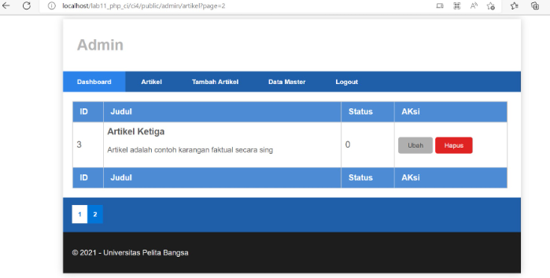

# Lab14web
untuk memenuhi tugas pemogramman web

Nama     : Antini permatasari 
NIM      : 312010095 
kelas    : TI.20.B.1 

# Praktikum 14
# Pagination dan Pencarian

# Membuat Pagination

Pagination merupakan sebuah fitur web yang digunakan untuk membatasi tampilan data agar tidak
terlalu panjang dan lebih rapih. 

1.Pada Codeigniter 4, fungsi pagination sudah tersedia pada Library sehingga cukup
mudah menggunakannya. 

selanjutnya Untuk membuat pagination, buka Kembali Controller Artikel,lalu kemudian modifikasi
kode pada method admin_index seperti berikut. 

2.Kemudian buka file views/artikel/admin_index.php dan tambahkan kode berikut
dibawah deklarasi tabel data. 

Selanjutnya buka kembali menu daftar artikel, tambahkan data lagi untuk melihat
hasilnya. 

# Membuat Pencarian

1.Pencarian merupakan fitur yang sangat membantu bagi pengguna sebuah aplikasi untuk mendapatkan,
sebuah informasi dengan cepat dan mudah. 
selanjutnya Untuk membuat pencarian data, buka kembali **Controller Artikel**, pada method
**admin_index** ubah kodenya seperti berikut. 

2.Kemudian buka kembali file views/artikel/admin_index.php dan tambahkan form
pencarian sebelum deklarasi tabel seperti berikut: 

Dan pada link pager ubah seperti berikut. 

Lalu kita ujicoba dengan membuka kembali halaman admin artikel, masukkan kata
kunci tertentu pada form pencarian. 

3.Lalu kita Menambahkan fungsi unggah gambar pada tambah artikel. Buka kembali **Controller Artikel**, sesuaikan kode pada method **add** seperti berikut: 

lalu Kemudian pada file views/artikel/form_add.php tambahkan field input file seperti
berikut. 

4.kemudian Pada file views/artikel/form_add.php tambahkan field input file seperti berikut. Dan sesuaikan tag form dengan menambahkan ecrypt type seperti berikut. 

Ujicoba file upload dengan mengakses menu tambah artikel. 

